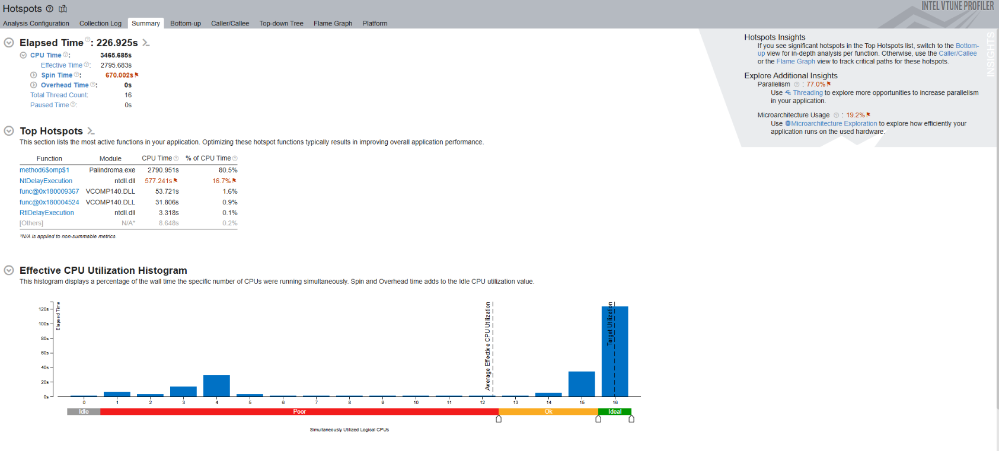
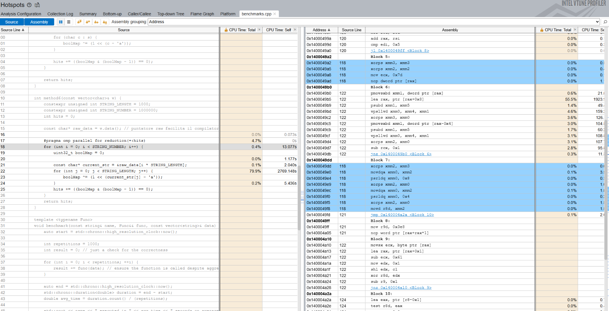
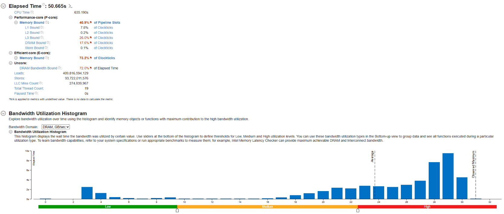
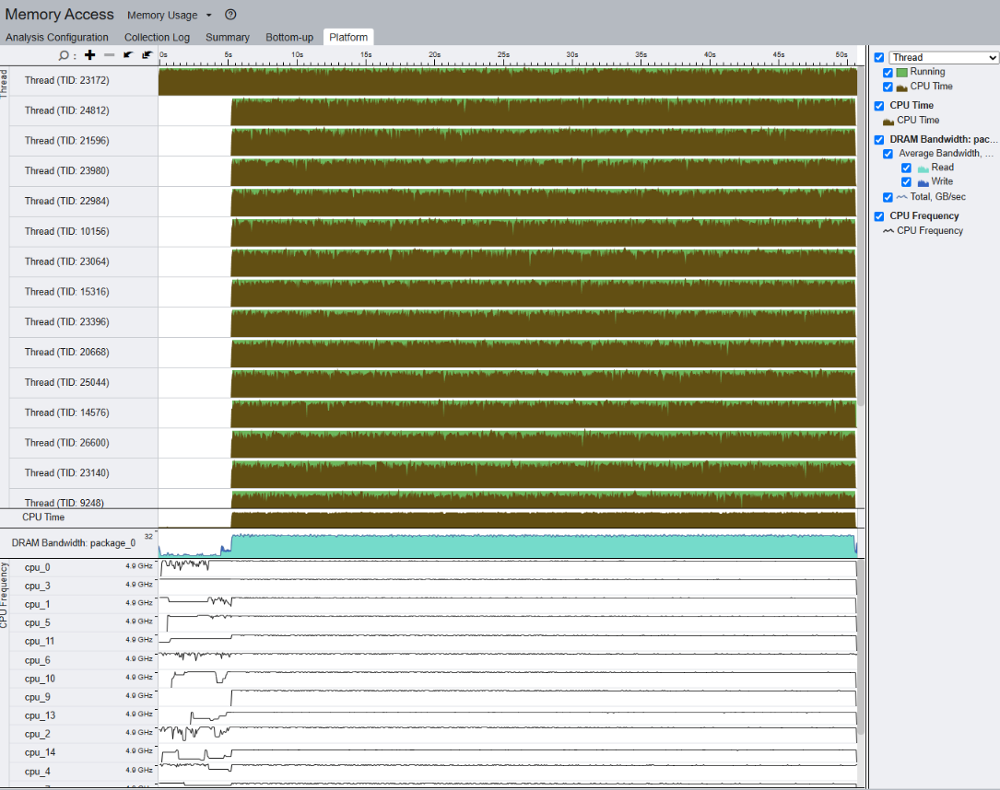
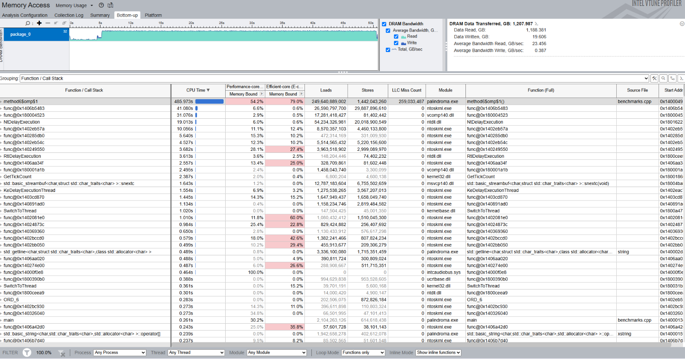
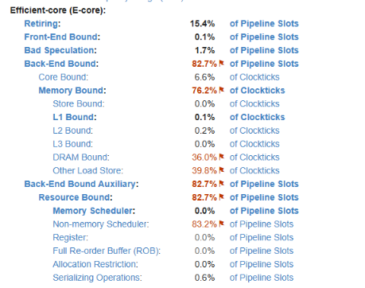
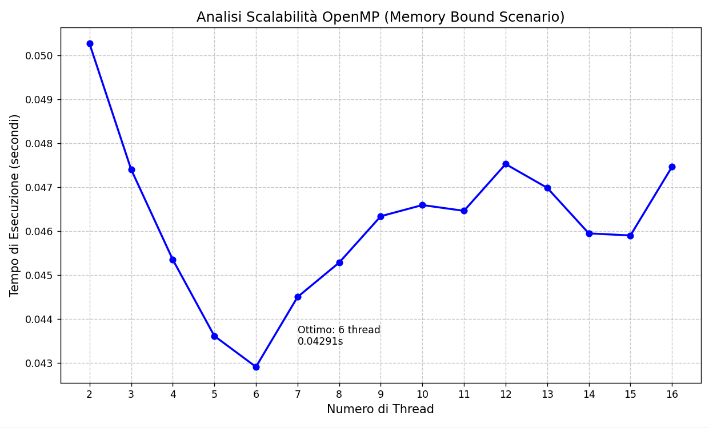

# Benchmarking e ottimizzazione: il mio percorso di studio per un 400x speed-up

Nel corso standard di _Algoritmi e strutture dati_, si impara a confrontare l'efficienza e la performance di un algoritmo, si entra in contatto con la "Big-O notation", la _complessità temporale asintotica_, provando a rispondere alla domanda: "man mano che la quantità di dati aumenta, tendendo a infinito, quale algoritmo è il più performante?"
Parlando di complessità asintotica, viene sempre specificato che le costanti moltiplicative non contano, che gli overhead non fanno la differenza tra un $O(n)$ e un $O(n^2)$. Il che, in effetti, è vero: quando si passa al limite che tende a infinito, tutto ciò smette di avere importanza.

Quello che si perde, invece, è il confronto tra due implementazioni diverse dello stesso algoritmo. Non c'è accenno al fatto che il risultato teorico è, appunto, teorico. Nella pratica si possono ottenere speedup di 2x, 10x, 100x e anche di più imparando a capire come funziona il computer, anche a parità di "passi logici" effettuati e di comportamento asintotico.

In questo post voglio dare un esempio "giocattolo" ma ugualmente esplicativo. Il tutto è nato in un test di ingresso della [CyberChallenge](https://www.cyberchallenge.it), in cui veniva chiesta la soluzione a un problema di palindromicità delle stringhe. Ho lanciato la sfida in aula studio con un'astrazione/semplificazione del problema, per vedere quale soluzione si sarebbe rivelata più efficace.

## Il problema

Il caso studio emerso è abbastanza noto in letteratura ed è il problema del "Palindromic Permutation check" (verificare se una stringa può diventare un palindromo). Semplificandolo ancora, abbiamo aggiunto dei constraints, per i seguenti motivi:

1. semplificazione del codice 
2. isolamento dei problemi relativi alle strutture dati usate
3. possibilità di sfruttare la conoscenza di dominio per efficientare maggiormente
4. riproducibilità dei test.

Siamo quindi arrivati a questa formulazione: "Si scriva un algoritmo per contare, su un file da 1M di stringhe da 1000 caratteri l'una, contenenti solo lettere minuscole dell'alfabeto inglese, quante di essere potessero essere riarrangiate e rese palindrome".

Un palindromo (come "radar" o "otto") può avere al massimo un solo carattere con frequenza dispari, quello centrale. Tutti gli altri caratteri devono apparire un numero pari di volte per essere simmetrici rispetto al centro. Dunque, il nostro algoritmo si riduce semplicemente al contare le occorrenze di ogni lettera e verificare che il numero di caratteri "solitari" (dispari) sia 0 oppure 1.

## Il test

Abbiamo creato un unico file di benchmark, così da avere lo stesso testcase per ogni implementazione dell'algoritmo. Per una buona randomicità, abbiamo usato una distribuzione uniforme.

```cpp
#include <iostream>
#include <fstream>
#include <string>
#include <random>
#include <vector>

constexpr int NUM_STRINGS = 1000000;
constexpr int STRING_LENGTH = 1000;
constexpr char ALPHABET[] = "abcdefghijklmnopqrstuvwxyz";

void writeRandomString(std::ostream& os, std::mt19937& gen, std::uniform_int_distribution<>& distrib) {
    std::string result;
    result.reserve(STRING_LENGTH);
    for (int i = 0; i < STRING_LENGTH; ++i) {
        result += ALPHABET[distrib(gen)];
    }
    os << result << '\n'; 
}

int main() {
    std::ios_base::sync_with_stdio(false);
    std::ofstream outputFile("random_strings.txt");

    if (!outputFile) return 1;

    std::random_device rd;
    std::mt19937 gen(rd());
    std::uniform_int_distribution<> distrib(0, 25);

    for (int i = 0; i < NUM_STRINGS; ++i) {
        writeRandomString(outputFile, gen, distrib);
    }

    outputFile.close();
    return 0;
}
```

Dato il file, manca anche un main uguale per tutti

```cpp
template <typename Func>
void benchmark(const string& name, Func&& func, const vector<string>& data) {
    auto start = std::chrono::high_resolution_clock::now();

    int repetitions = 1000;  // flattens variability
    int result = 0; 

    for (int i = 0; i < repetitions; ++i) {
        result += func(data); // ensure the function is called despite aggressive -O3 optimizations
    }

    auto end = std::chrono::high_resolution_clock::now();
    std::chrono::duration<double> duration = end - start;
    double avg_time = duration.count() / (repetitions);

    std::cout << name << " executed in " << avg_time << " seconds on average. Result: "<< result << std::endl;
}
```

Il computer usato per il benchmark ha queste caratteristiche:

- sistema operativo Microsoft Win11 Home

- CPU: i7-13620H; Base speed: 2.40 GHz; Sockets: 1, Cores: 10, Logical processors: 16

- Cache: L1: 864 KB, L2: 9.5 MB, L3: 24.0 MB

- Memoria: 40Gb DDR4; 3200MT/s; su 2 slot. _Nota: La configurazione asimmetrica implica l'utilizzo della modalità "Flex Mode". Solo i primi 8GB operano in Dual Channel simmetrico, mentre la parte restante lavora in Single Channel. Questo avrà un impatto significativo sulla banda massima teorica osservabile._
  
  ## Le implementazioni
  
  Il primo istinto di ogni programmatore moderno è usare gli strumenti che il linguaggio mette a disposizione. Per contare le occorrenze, la scelta ricade naturalmente su una Tabella Hash.
  
  ```cpp
  int method1(const vector<string>& v){
    int hits = 0;
    std::unordered_map<char, bool> map;
    for (const string& s : v) {
        for(char c : s){
            if (map.find(c) == map.end())
                map[c] = true;
            else
                map.erase(c);
        }
        map.clear();
        hits += (map.size() <= 1);  // false = 0
    }
    return hits;
  }
  ```
  
  È leggibile e universale. Concettualmente è perfetto: aggiungiamo se manca, togliamo se c'è già. Alla fine, se la dimensione è ≤1, la stringa è una permutazione palindroma.
  Un'alternativa equivalente è quella di usare un set. L'idea è che, se dobbiamo solo tenere conto della parità, quindi mappare un char a un booleano, basta la chiave: se il carattere c'è, lo elimino dal set, altrimenti lo aggiungo. Praticamente simuliamo uno switch on/off.
  
  ```
  int method2(const vector<string>& v){
    int hits = 0;
    std::unordered_set<char> set;
    for (const string& s : v) {
        for(char c : s){
            auto [it, inserted] = set.insert(c);
            if (!inserted)
                set.erase(it);
        }
        set.clear();
        hits += (set.size() <= 1);  // false = 0
    }
    return hits;
  ```
  
  Quando lanciamo il benchmark, il codice è così lento che lo fermiamo, riducendo le ripetizioni a solo 10. La funzione ci mette circa 20 secondi a processare l'intero file. Perché?
1. **Overhead di Allocazione**:  una mappa hash deve gestire bucket, puntatori e potenziali collisioni. Moltiplicato per un milione di stringhe, il costo di gestione della memoria diventa enorme. 
2. **Hashing**: Per ogni singolo carattere della stringa, il computer deve calcolare una funzione di hash. Nonostante le funzioni di hash siano veloci per costruzione, farlo 1 miliardo di volte (1M stringhe × 1000 caratteri) richiede una potenza di calcolo non indifferente.
3. **Cache Miss**: La mappa memorizza i dati in modo sparso nella memoria. Il funzionamento della cache prevede che i dati vengano recuperati dalla memoria principale a piccoli blocchi di memoria contigua (64b). Se viene richiesto un dato che si trova in un'area di memoria attualmente non in cache, si verifica un cosiddetto cache miss, e andare a recuperarlo in RAM è ***incredibilmente*** lento:
   - usare i dati nei registri ha costo 0;
   - per recuperare un dato dalla L1 (L1 hit) ci vogliono ~4 cicli di clock;
   - dalla L2 (L2 hit) il costo è comunque contenuto, siamo sulla decina;
   - già per la L3 siamo sulla cinquantina;
   - per recuperare un dato dalla memoria principale, ci vogliono circa 200 cicli di clock. decine di nanosecondi.
     Basti pensare che una cpu moderna buona nello stesso tempo si possono fare 400 moltiplicazioni floating point.

La soluzione è abbastanza immediata. Abbiamo dei costraint fissi (in particolare l'alfabeto). È davvero necessaria una struttura dati complessa capace di gestire l'intero universo Unicode per gestire solo 26 possibilità? Non solo, è davvero necessario allocare continuamente memoria nello heap? 

 Al posto di una mappa o di un set, possiamo usare direttamente un array di 26 byte: se il carattere è presente, decrementa di uno, altrimenti aggiungi 1. 

```cpp
int method3(const vector<string>& v){
   int hits = 0;

   for (const string& s : v) {
       array<short, 26> array{0};
       for(char c : s){
           if (array[c-'a'])
               array[c-'a']--;
           else 
               array[c-'a']++;
       }
       hits += (std::accumulate(array.begin(), array.end(), 0) <= 1);
   }
   return hits;
}
```

Notare che l'implementazione scelta è (volutamente) inefficiente: nella fase di accumulo, si potrebbe inserire un early stopping, uscendo anticipatamente appena il conto arriva a 2. Abbiamo scelto di lasciare così per mostrare come, nonostante ciò, ottenessimo uno speedup notevole:

```
Method 1, map, executed in 18.5099 seconds on average. Result: 10
Method 2, set, executed in 18.3205 seconds on average. Result: 10
Method 3, arr, executed in 0.35545 seconds on average. Result: 10
```

<small>(tra vari lanci del programma il singolo metodo può cambiare, ma nello stesso lancio, lo speedup rimane sufficientemente costante)</small>
$18.3205/0.35545 =~ 51.5$. Cinquanta volte più veloce!

E se fossero bit, al posto di byte? Dopotutto, quello che calcoliamo realmente è la parità, non effettivamente il numero di occorrenze. Un intero, quantomeno nell'implementazione standard di C++, è costituito da 32 bit. E $26<32$.

Quindi possiamo trasformare il nostro array in un singolo intero: `uint32_t boolMap = false;`
Ma poi come facciamo a fare la verifica nell'if all'interno del for?

```cpp
unsigned int mask = (1 << (c - 'a'));
if ((boolMap & mask) != 0) {
    boolMap &= ~mask;
} else {
    boolMap |= mask;
}
```

Ovvero: se il bit è settato a 1, lo "spegniamo", altrimenti lo "accendiamo". Ad occhi attenti risulterà facile notare che significa letteralmente invertire lo stato del bit, quindi l'intera operazione può essere resa ancora più efficiente e branchless, usando l'operatore XOR, in un'unica riga di codice.
`boolMap ^= (1 << (c-'a'))`
Manca infine l'incremento della variabile hit. Cosa serve? che ci sia al massimo un bit settato:

```cpp
int bitCount = 0;
for (int i = 0; i < 32; i++) {
    if ((boolMap >> i) & 1) {
        bitCount++;
    }
}
if (bitCount  <= 1) {
    hits++;
}
```

Esiste un modo molto più efficiente di controllare che un singolo bit sia settato. In effetti, `0b00001000 -1 = 0b00000111` e `0b00001000 & 0b00000111 = 0`.
Possiamo quindi ridurre anche questo controllo a una singola riga branchless: `hits += ((boolMap & (boolMap - 1)) == 0)`.
Curiosità: questo controllo equivale a fare la verifica che un numero sia potenza di 2 (o 0). E, sebbene controintuitivo, funziona anche se non ci sono bit settati: `boolMap - 1` produce -1, che in complemento a 2 è `0b11111111`, che in AND ritorna effettivamente 0.
La funzione completa diventa quindi molto elegante, senza `if` e senza cicli, ad esclusione di quelli che iterano sulle stringhe e sui caratteri:

```cpp
int method4(const vector<string>& v){
    int hits = 0;

    for (const string& s : v) {
        uint32_t boolMap = 0;

        for(char c : s){
            boolMap ^= (1 << (c-'a'));

        }
        hits += ((boolMap & (boolMap - 1)) == 0);
    }
    return hits;
}
```

Lo speedup è rilevante:

```
Method 2, set, executed in 18.6146 seconds on average. Result: 10
Method 3, arr, executed in 0.474957 seconds on average. Result: 10
Method 4, int, executed in 0.124643 seconds on average. Result: 10
```

Quasi 4 volte più veloce del metodo precedente e **150** volte del metodo con il set.

## Le ottimizzazioni

Siamo arrivati alla fine teorica. Questa è l'implementazione scalare più efficiente che ci sia con questi vincoli.
Passiamo allora ad ottimizzazioni ad-hoc, possiamo per esempio applicare un po' di parallelismo o cambiare il layout dei dati in memoria per eliminare qualche cache miss.
Per prima cosa, usiamo OpenMP per ottenere parallelizzazione sui core:

```cpp
int method5(const vector<string>& v) {
    int hits = 0;
    int size = v.size();

    #pragma omp parallel for reduction(+:hits)
    for (int i = 0; i < size; i++) {
        uint32_t boolMap{false};
        const string& s = v[i];
        for (char c : s) {
            boolMap ^= (1 << (c - 'a'));
        }
        hits += ((boolMap & (boolMap - 1)) == 0);
    }
    return hits;
}
```

Come c'era da immaginarsi, lo speedup è reale: ci sono 16 core che lavorano in contemporanea.

```cpp
Method 4, int, executed in 0.128518 seconds on average. Result: 100
Method 5, omp, executed in 0.0608337 seconds on average. Result: 100
```

10 core fisici, 16 core logici, eppure lo speedup è solo del doppio (e **300x** sui primi metodi).
A questo punto, se si vuole ancora ottimizzare, non è fattibile andare avanti alla cieca. Ci sono chiaramente dei colli di bottiglia da indagare. Il Tool di analisi che usiamo è Intel VTuneProfiler. Per rendere più equilibrato il test, abbiamo aumentato le ripetizioni a 1000 (così che la funzione prendesse la maggior parte del tempo, più del caricamento iniziale delle stringhe in ram)


L'analisi di VTune conferma il sospetto: trattandosi di un task computazionalmente leggero, stiamo spendendo una quantità enorme di tempo a gestire i thread invece di fare calcoli. Nonostante i core a disposizione, il report indica un Parallelism del 79.0%. In un mondo ideale con un task così "imbarazzantemente parallelo", dovremmo essere vicini al 90-100%. 

* Il problema principale è evidenziato nello Spin Time (1547.648s). Questo significa che i thread stanno girando a vuoto (attesa attiva) aspettando di sincronizzarsi: nella tabella Top Hotspots, la seconda voce dopo il calcolo vero e proprio è NtDelayExecution (12.7% del CPU Time). Questa funzione è legata alla gestione degli sleep/wait del kernel Windows. Indica che l'overhead di OpenMP per gestire il loop è eccessivo rispetto al corpo del loop stesso.
* VTune segnala un Microarchitecture Usage del 15.0%. È un valore molto basso. Suggerisce che la CPU è ferma ad aspettare i dati (Memory Bound) o che ci sono continui "stalli".
* L'istogramma in basso mostra che la maggior parte del tempo la macchina lavora con 15-16 thread (Target Utilization), il che è positivo. Tuttavia, il fatto che lo speedup sia solo 2x nonostante l'uso di 16 core conferma che i core sono utilizzati, ma non sono "produttivi".

In particolare Microarchitecture Usage è un'indicatore importante del nostro problema e di come potremmo migliorare ulteriormente le prestazioni. Siamo chiaramente di fronte a una situazione memory-bound: la CPU elabora i dati molto più velocemente di quanto riesca a recuperarli dalla memoria. Se riuscissimo a recuperare i dati più velocemente, avremmo un ulteriore speedup. Non solo, indirettamente aiuteremmo anche il parallelismo. Sistemare il memory bound è spesso il prerequisito fondamentale per rendere efficace il parallelismo.

* Un `std::vector<std::string>` è, tecnicamente, un vettore contiguo di "header" che puntano a buffer di memoria sparsi, cosa che causa doppia indirezione (Vector -> String Header -> Char Buffer). Ogni thread legge l'indirizzo della stringa nel vettore, poi deve "saltare" a quell'area di memoria per leggere il contenuto. Non essendoci garanzia di continuità, è facile che ciò si traduca in un cache miss, che manda il thread in stallo, in attesa dei dati. Se usassimo un buffer contiguo in memoria, la CPU vedrebbe un flusso lineare di byte. L'Hardware Prefetcher avrebbe quindi spazio d'azione per capire il pattern e caricare i dati dalla ram _prima_ ancora che il thread li richieda, facendoli trovare già pronti in cache
* I core passano attraverso lo stesso bus per arrivare in RAM. Se il layout è sparso, ogni core richiede cache lines che contengono molto rumore, saturando il bus di dati inutili. Con un layout contiguo, ogni pacchetto di dati è denso di informazioni utili, riuscendo quindi a ottimizzare la banda.

Proviamo quindi a usare un `vector<char>` . Nel nostro specifico caso siamo anche fortunati in quanto, conoscendo a priori la lunghezza fissa delle stringhe, non è necessario avere anche quel metadato.
Usiamo i puntatori raw per dare facilitare il lavoro al compilatore. abbiamo anche aggiunto un piccolo suggerimento al runtime di OpenMP riguardante lo scheduling dei thread:

```cpp
int method6(const vector<char>& v) {
    constexpr unsigned int STRING_LENGTH = 1000;
    constexpr unsigned int STRING_NUMBER = 1000000;
    int hits = 0;

    const char* raw_data = v.data(); 

    #pragma omp parallel for reduction(+:hits) schedule(static)
    for (int i = 0; i < STRING_NUMBER; i++) {
        uint32_t boolMap = 0;

        const char* current_str = &raw_data[i * STRING_LENGTH];
        for (int j = 0; j < STRING_LENGTH; j++) {
            boolMap ^= (1 << (current_str[j] - 'a'));
        }
        hits += ((boolMap & (boolMap - 1)) == 0);
    }
    return hits;
}
```

La performance è nettamente migliorata:

```
Method 5, omp, executed in 0.0577216 seconds on average. Result: 1000                          Method 6, omp + cache locality, executed in 0.045903 seconds on average. Result: 1000
```

Cioè uno speedup maggiore del +25%.

I risultati sono chiari ,il passaggio a un layout di memoria contiguo ha dato i suoi frutti. Ma se facciamo nuovamente un'analisi con vtune, il report mostra chiaramente che non è sufficiente.


* Notiamo subito che l'indice Microarchitecture Usage è salito dal 15.0% al 19.2%, dato positivo che conferma che la CPU ha più lavoro attivo. Tuttavia il dato è ancora basso.
* Stranamente però notiamo che la Parallelism Efficiency è scesa leggermente (da 79% a 77%), ed è anche aumentato NtDelayExecution. Questo avvalora ulteriormente la tesi per cui il programma è memory bound. Abbiamo raggiunto il *Memory Bandwidth limit*? Cioè, il bus di memoria è saturo e non è fisicamente possibile leggere dati più velocemente?

Allo stato attuale delle cose, sembrerebbe inutile qualsiasi tipo di ottimizzazione ulteriore, in quanto non è la cpu il collo di bottiglia, ma la velocità di caricamento dalla memoria. Sebbene controintuitivo, invece, il SIMD (cioè sfruttare i registri AVX per ulteriore *instruction level parallelism*) può aiutare. Non è infatti vero che questa situazione è causata per forza dalla saturazione del bus. Può essere che la cpu non "chieda" abbastanza spesso nuovi dati. 
Controlliamo l'assembly generato

Guardando per esempio il blocco 6, si vedono già istruzioni che appartengono al set SSE/AVX, conferma che il compilatore ha già auto-vettorizzato il loop meglio che poteva (considerando anche che `vector<char>` non è allineato e 1000 non è potenza di 2).

* `vpsllvd xmm0, xmm4, xmm1`: Questa è un'istruzione AVX2 (Variable Shift Left Logical) che esegue lo shift a sinistra su un vettore di interi.
* `vpxor xmm2, xmm2, xmm0`: Esegue lo XOR vettoriale.
* `pmovsxbd xmm1, dword ptr [rax]`: Converte (sign-extend) i byte caricati dalla memoria in interi a 32 bit all'interno di un registro vettoriale.
* L'uso dei registri `xmm1, xmm2`, ecc., indica che il calcolo sta avvenendo su vettori (in questo caso di 128 bit). Non stiamo ancora sfruttando i registri YMM a 256-bit, probabilmente a causa del mancato allineamento dei dati.

Guardando i dati del profiler, notiamo anche una cosa interessante: il 55.5% del tempo è speso sull'istruzione `lea rax, ptr [rax+0x8]`. Questo potrebbe suggerire che la cpu fatica ugualmente a gestire gli indirizzi di memoria e forse anche che un eventuale unrolling potrebbe dare un leggero aiuto. Il bottleneck comunque rimane la memoria: la CPU passa il **79.9%** del tempo sul loop dei caratteri. Cosa significa?
Possiamo continuare a tirare a indovinare, provando l'unrolling manuale o usando AVX2 per verificare se si riesce a guadagnare qualcosa. Oppure, in modo più intelligente, si possono guardare altre metriche.
Facciamo partire il profiler della memoria:








Infine, guardiamo anche il profiler_microarchitecture





Ci sono dati molto interessanti che emergono da entrambe le analisi. Stabilito che il massimo fisico di memory bandwidth osservato da Vtune è attorno a 32Gb/s, notiamo che la quasi totalità del tempo il valore reale è sopra 20. c'è un leggero picco a saturazione bassa che rappresenta il caricamento dati iniziale. Il picco maggiore è a bandwidth 29Gb/s.
Isolando solo la sezione di benchmarking effettivo (senza il caricamento iniziale), la media è a 26Gb/s, molto vicino al limite teorico di saturazione massima osservato.
È doveroso aprire una parentesi hardware qui. Il limite teorico di una DDR4-3200 in Dual Channel puro sarebbe di circa 51.2 GB/s. Tuttavia, noi stiamo osservando un muro attorno ai 26-29 GB/s, circa la metà del picco teorico. Dato l'hardware in uso (40GB di RAM totali), è altamente probabile che il sistema stia operando in 'Flex Mode' e probabilmente stiamo colpendo un collo di bottiglia ibrido Single/Dual Channel, che rende difficile l'analisi di questo contesto. Essendo una frazione di ram relativamente piccola, è facile saturare la memoria in dual channel per sistemi operativi moderni, in particolare per windows, quindi è plausibile che i dati necessari al benchmark siano stati allocati anche nella zona "lenta".

Per più del 70% del tempo, il processore è rimasto ad aspettare. Da questo punto di vista, è interessante notare la differenza tra gli e-cores (efficiency) e i p-cores (performance), il forte squilibrio contribuisce alla bassa parallelism efficiency riscontrata inizialmente. Dall'analisi della microarchitettura, c'è un dato interessante per quanto riguarda i p-cores: del 15.3% di tempo in cui i P-core sono rimasti bloccati aspettando dati dalla RAM, il 90.3% di quelle attese è stato causato dalla saturazione della banda, mentre solo il 5.8% è stato causato dalla latenza (il tempo di viaggio del singolo dato). Questo dato, unito al 72% di bus occupancy, indica che il layout di memoria è molto buono. Dati positivi sono invece il Front-End Bound, che è sotto controllo e non causa bottleneck particolari, e il dato ottimo sulla bad speculation, che è 0 (non stupisce, avendo un loop branchless).
Il verdetto è che, senza cambiare il modo in cui i dati sono rappresentati in memoria (bit packing), non c'è molto da fare a livello di bandwidth. 
Un dato interessante e un po' controintuitivo è invece `L3 Bound: 30.1%`. Questo indica che i core si stanno contendendo l'ultimo livello di cache, andando a sovrascriversi a vicenda (ciò deriva da come il sistema operativo gestisce le pages della cache). Un ultimo tentativo potrebbe essere paradossalmente quello di abbassare il numero di thread. La cpu infatti non sta facendo molta fatica, e aumentare il parallelismo porta solo a maggior resource contention. Non solo, come vedremo dopo era anche _prevedibile_ il fatto che 16 thread non fosse l'ottimale, per la configurazione della cpu in uso.

```cpp
int method7(const vector<char>& v, int threads) {
    constexpr unsigned int STRING_LENGTH = 1000;
    constexpr unsigned int STRING_NUMBER = 1000000;
    int hits = 0;
    const char* raw_data = v.data();

    #pragma omp parallel for reduction(+:hits) num_threads(threads)
    for (int i = 0; i < STRING_NUMBER; i++) {
        uint32_t boolMap = 0;

        const char* current_str = &raw_data[i * STRING_LENGTH];
        for (int j = 0; j < STRING_LENGTH; j++) {
            boolMap ^= (1 << (current_str[j] - 'a'));
        }
        hits += ((boolMap & (boolMap - 1)) == 0);
    }
    return hits;
}
```



BINGO! 

```
Method 7, omp + cache locality 2 threads executed in 0.0502693 seconds on average. Result: 500
Method 7, omp + cache locality 3 threads executed in 0.0474054 seconds on average. Result: 500
Method 7, omp + cache locality 4 threads executed in 0.0453521 seconds on average. Result: 500
Method 7, omp + cache locality 5 threads executed in 0.0436119 seconds on average. Result: 500
Method 7, omp + cache locality 6 threads executed in 0.0429084 seconds on average. Result: 500
Method 7, omp + cache locality 7 threads executed in 0.0444997 seconds on average. Result: 500
Method 7, omp + cache locality 8 threads executed in 0.0452828 seconds on average. Result: 500
Method 7, omp + cache locality 9 threads executed in 0.046339 seconds on average. Result: 500
Method 7, omp + cache locality 10 threads executed in 0.0465932 seconds on average. Result: 500
Method 7, omp + cache locality 11 threads executed in 0.0464618 seconds on average. Result: 500
Method 7, omp + cache locality 12 threads executed in 0.0475269 seconds on average. Result: 500
Method 7, omp + cache locality 13 threads executed in 0.0469856 seconds on average. Result: 500
Method 7, omp + cache locality 14 threads executed in 0.0459484 seconds on average. Result: 500
Method 7, omp + cache locality 15 threads executed in 0.0459006 seconds on average. Result: 500
Method 6, omp + cache locality, executed in 0.0474653 seconds on average. Result: 500
```

Se fossimo andati avanti a tentativi casuali, ci saremmo totalmente persi una delle cause di rallentamento, e non avremmo ottenuto ulteriori miglioramenti. Nel nostro specifico caso, lo sweet point si raggiunge con soli 6 thread invece di 16, in quanto gli accessi alla memoria non sono ulteriormente ottimizzabili (a meno di cambiare rappresentazione binaria), e risulta esserci molto overhead dovuto ai thread e al data racing. Come accennato in precedenza, analizzando l'hardware a disposizione, il processore è un **i7-13620H**, che utilizza l'architettura ibrida p-cores/e-cores. Non è un caso che lo sweet point sia a 6 threads, in quanto sono esattamente 6 i p-cores fisici. Superato questo punto, lo scheduler inizia a usare l'hyperthreading o gli e-cores, che sono decisamente più lenti. 
Non resta che fare un test con tutti i metodi. Per farlo, ho modificato le funzioni di benchmark perché accettino un numero di ripetizioni personalizzato, altrimenti ci sarebbe stato squilibrio troppo grande tra il tempo di esecuzione per ogni metodo, andando a incidere anche sulla varibilità casuale del benchmark. Ho impostato il benchmark per far sì che tutti i casi impiegassero circa un minuto o un minuto e mezzo di esecuzione.

```
Method 1, map,    5 rep, executed in 18.261 seconds on average. Result: 5
Method 2, set,    5 rep, executed in 17.8297 seconds on average. Result: 5
Method 3, arr,  150 rep, executed in 0.35433 seconds on average. Result: 150
Method 4, int,  500 rep, executed in 0.131502 seconds on average. Result: 500
Method 5, omp, 1000 rep executed in 0.0584716 seconds on average. Result: 1000
Method 6, omp + cache locality, 16 threads, 1300 rep executed in 0.0483463 seconds on average. Result: 1300
Method 7, omp + cache locality,  6 threads, 1500 rep executed in 0.0438309 seconds on average. Result: 1500
```

Speed-up finale: **417x**

## Annotazioni finali

1. Avendo stringhe lunghe 1000, non avremo mai stringhe con un solo carattere che ha occorrenze dispari, ma non è un problema in quanto il caso con occorrenze pari è gestito dalla logica "power of two or zero". In più, al file è stata aggiunta manualmente una stringa palindroma, ed è l'unica sul milione di stringhe. Di conseguenza, il risultato finale è sempre uguale al numero di ripetizioni. Anche questo non influisce sull'analisi.
2. Parte dell'overhead dei thread è anche dovuto al fatto che la direttiva openMP è all'interno della funzione, sarebbe più efficiente dichiararli all'esterno, ma non sarebbe un benchmark onesto. Questo dimostra anche che per lavori così piccoli, la parallelizzazione ha grossi overhead e non fa miracoli.
3. le utlime micro-ottimizzazioni sono hardware-dipendenti. Su un computer con quantità di cache diverse, o ram DDR5, potrebbero servire altri tipi di ottimizzazione, o il numero di thread ottimale potrebbe variare
4. dal metodo 6 in poi, è richiesto un cambiamento del layout dei dati in memoria. Questo è valido esclusivamente ai fini di questo test. In un contesto reale, l'overhead di creazione del singolo `vector<char>` è decisamente maggiore del piccolo guadagno ottenuto in termini di prestazioni
5. L'impatto del Single Channel: I risultati di bandwidth mostrati da VTune sono coerenti con i limiti fisici di un'architettura di memoria parzialmente Single Channel (dovuta ai 40GB installati). Su una macchina con RAM simmetrica (es. 16GB+16GB), il Memory Wall si sarebbe spostato più in alto, permettendo probabilmente un ulteriore speedup nei metodi parallelizzati prima di saturare il bus.
6. Un'ulteriore ottimizzazione non implementata in questo test riguarda l'allineamento della memoria. Usando stringhe da 1000 byte, non siamo allineati ai 32/64 byte delle cache line o dei registri AVX, costringendo il compilatore a gestire il 'tail processing' in modo subottimale. Un padding a 1024 byte avrebbe probabilmente sbloccato performance SIMD migliori
